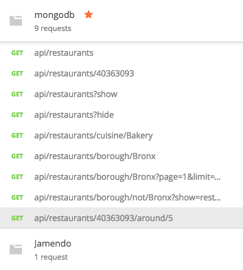
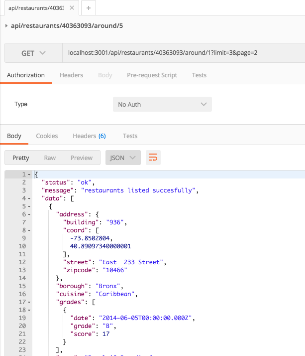

[](http://www.skylabcoders.com/)


### Express & Mongo API demo.

Pequeña API de consultas a una base de datos MongoDB.

### CONFIGURACION PREVIA.
Sigue las [instrucciones][import-data] propias de MongoDB para importar el JSON con los datos de restaurantes.

Una vez importados, recuerda que para hacer [consultas geo-referencidas][geospatial-queries] debes indicar el campo que contiene las coordenadas, tan sencillo como ejecutar el siguiente comando en la tabla _restaurants_:

```javascript
    db.restaurants.ensureIndex({ "address.coord": "2dsphere" })
```

### INSTALACION.

Para instalar este proyecto:

```bash
    $ git clone https://github.com/mtzfactory/express-mongo-api.git
    $ cd express-mongo-api
    $ npm install
    $ npm start
```

[import-data]: https://docs.mongodb.com/getting-started/shell/import-data/
[geospatial-queries]: https://docs.mongodb.com/manual/geospatial-queries/





#### SkylabCoders Academy - Full Stack Web Development Bootcamp